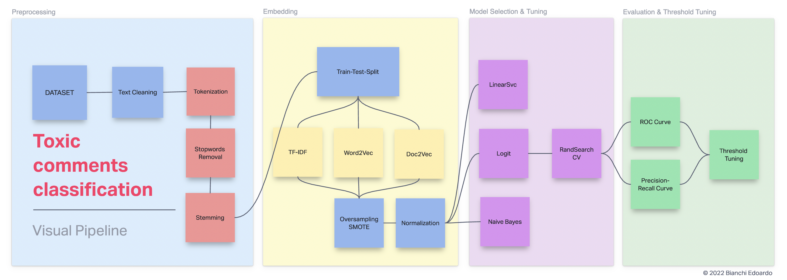

# Toxic Comments Classification

## Overview
End-to-end **toxic comments classification** project focusing on **Semantic Representation of text**. Capturing the meaning of a text is non-trivial and involves **cosidering of the context** (analysis of surrounding words). In order to take care of the context, we can **leverage advanced methods like Word2Vec and Doc2Vec**. In this project **different methods and approaches are combined and compared**.

A **demo application** using the trained models is hosted at <https://huggingface.co/spaces/EdBianchi/Social_Toximeter>.

## Motivations
With the advent of social networks, blogs and online chats the human psychology is changing: **likes, comments and tags have a real and concrete role in our lives**, going from a "virtual" world to reality. The impact of **toxic comments affects the engagement of users** in conversations. Many people stop expressing themselves and give up in presence of a threat of abuse and harassment online.

This means that **platforms and users loose the ability to be involved in constructive conversations.**  Moreover, the severity and viciousness of these comments has evolved into something much more sinister such as the 2021 US capitol riots and several cases of suicide, even among very young people. Identify toxic comments can **lead communities to facilitate and improve online conversations and exchange of opinions**.

## Abstract
After importing the data, that is raw comments, we proceed with an **initial cleaning of the text**, with the aim of removing textual elements that are not to be considered during the subsequent analysis (mentions, hashtags, repeated spaces, ...). We then proceed with some **classic NLP tasks, namely the removal of stopwords, tokenization and stemming.** The raw text is then transformed into a list of words, called tokens. **We turn the resulting words into numbers, more precisely arrays of numbers.** We will use three approaches: the first is very simple and based on word frequencies (TF-IDF), the others are more complex (Word2Vec, Doc2Vec). **The vectors resulting from these operations will be used by machine learning models** to make predictions about new comments. In particular **we will test different models**: logistic regression, naive bayes and linear svm. At the end we will choose **the combination of encoding and model that perform better**, and we will proceed with the **fine tuning, looking for the best parameters and the best threshold.** I also developed **a demo application** for this classifier, hosted on my Hugging Face. 

## Main Steps of the Project
This is an end-to-end project covering all the necessary steps from text preprocessing to final classification and tuning.

The project consists of the following main sections (wich may consist of different subsections):

1. Importing Tools
2. Importing Data and Cleaning
3. Preprocessing Text - NLP pipeline
4. Some Visualization
5. Splitting the data in training and testing sets
6. Different Embeddings: TF-IDF, Word2Vec, Doc2Vec
7. Dealing with Imbalanced Classes
8. Features Normalization
9. Algorithm Selection and Hyperparameter tuning
10. Performance of the model
11. ROC, AUC, Precision-Recall Curve
12. Threshold Tuning
13. Demo App & Further Steps
14. Drawing conclusions — Summary

## Data Set
The dataset for this project is hosted on Kaggle and was part of a competition. According to the description on Kaggle, *The Conversation AI team, a research initiative founded by Jigsaw and Google (both a part of Alphabet) are working on tools to help improve online conversation. One area of focus is the study of negative online behaviors, like toxic comments.*

**The goal of this project is slightly different from the original one: here i will perform a binary classification of the comments** (instead of the multiclass multioutput defined in the original competition).

I will use only the train set provided by Kaggle and i will proceed with the usual splitting into train and test sets. **The dataset consists of 143346 non-toxic comments and 16225 toxic comments. A comment is considered toxic if belongs to at least one of the toxicity categories provided in the original dataset.** The original toxicity labels have been assigned in a manual way by humans, according to the description of the dataset available on Kaggle.

The dataset contains the raw comments, extracted as they were originally posted by users. **This comments have been extracted from Wikipedia talks pages.** For more details about the dataset, please refer to the competition page on Kaggle, at <https://www.kaggle.com/competitions/jigsaw-toxic-comment-classification-challenge>.
